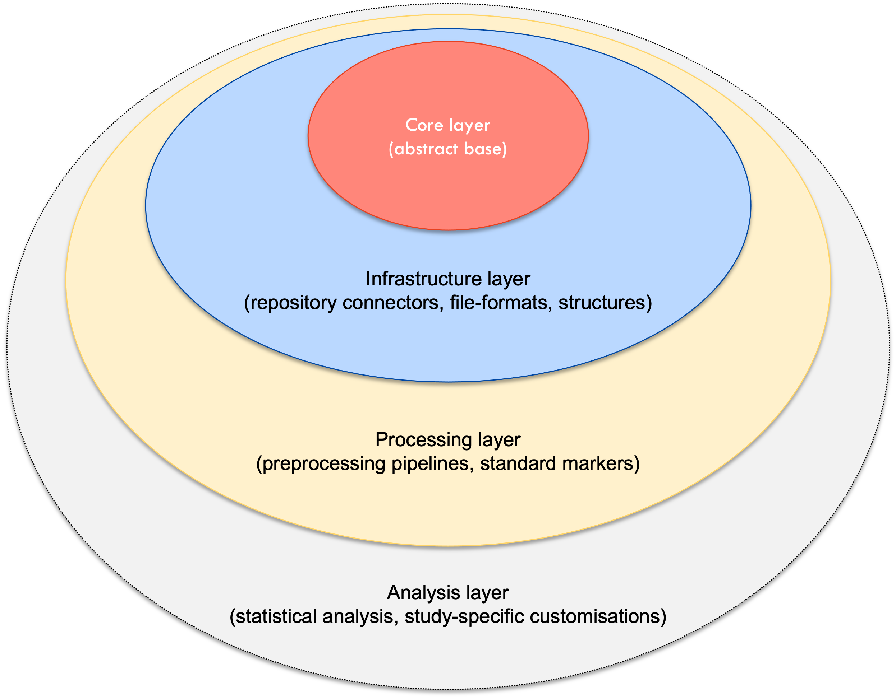

.. _home:

Arcana
======

Arcana (Abstraction of Repository-Centric ANAlysis) is an informatics framework for
analysing datasets "in-place", i.e. pulling data from a data store to a
(typically neighbouring) computing resource, performing computations on the
data, and then uploading the processed data back to the store alongside the
original data. Arcana has been designed to address many of the challenges typically
faced when analysing large medical-imaging projects, but should make your
life easier no matter the size of your dataset or field of study!

Data store interactions are abstracted by modular handlers, making
worklows portable between different storage systems. Other tedious aspects of
workflow design, such as iteration, file-format conversions and management of
provenance data are also abstracted away from the designer, enabling them
to focus on the core logic of the analysis to be implemented.

Arcana's approach has several advantages over typical workflow design, particularly
when analysing large datasets:

* Derivatives are kept in central location, avoiding duplication of processing
* Incremental processing facilitates manual-QC of intermediate products at key milestones in the workflow (e.g. brain masks)
* Abstraction of implementation details promotes development of shared workflow libraries, which can be refined over time to capture the domain-specific **arcana of data analysis** *(the obscure knowledge required to apply an appropriate combination of tools and parameters to analyse complex datasets)*.

The Arcana framework can be broken down into four conceptual layers:

* **Core layer** - abstract base classes and core pipeline logic
* **Infrastructure layer** - Repository system connectors, file formats and data structures
* **Processing layer** - Preprocessing pipelines and methods to derive standard markers
* **Analysis layer** - Statistical analysis methods and study-specific customisations

|

|

The core and infrastructure layers are largely developed by the main Arcana developer team
(see `Authors  <https://github.com/Australian-Imaging-Service/arcana/blob/main/AUTHORS>`_).
Processing layers for neuro-MRI and molecular imaging are being developed as part of the
Australian Imaging Service in the `core pipelines repository <https://github.com/Australian-Imaging-Service/pipelines-core>`_.
Since the analysis layer is typically study-specific, it is often left to the
end user to implement (noting that outputs from the processing layer
can be used directly if desired)

Although designed to efficiently handle the requirements typical of medical imaging
workflows (i.e. manipulation of file-based images by various third-party
tools), at its core, Arcana is a general framework, which could be
used to design analyses in any field. If you do end up using Arcana in a
different domain please post an issue about it in the
`issue tracker <https://github.com/Australian-Imaging-Service/arcana/issues>`_
to let us know!

Arcana also includes tools for deploying pipelines in Docker images that
can be run in `XNAT's container service <https://wiki.xnat.org/container-service/>`_
(`BIDS apps <https://bids-apps.neuroimaging.io/>`_ support is planned in the future)
. These tools can be used
to maintain continuous integration and deployment of pipeline suites (see
`Australian Imaging Service Pipelines <https://github.com/australian-imaging-service/pipelines-core>`_).

.. toctree::
   :maxdepth: 2
   :hidden:

   getting_started
   data_model
   processing
   deployment

.. toctree::
   :maxdepth: 2
   :caption: Development
   :hidden:

   contributing
   design_analyses
   adding_formats
   Alternative storage <alternative_stores.rst>

.. toctree::
   :maxdepth: 2
   :caption: Reference
   :hidden:

   CLI <cli.rst>
   API <api.rst>

|

.. note::
   For the legacy version of Arcana as described in
   *Close TG, et. al. Neuroinformatics. 2020 18(1):109-129. doi:* `10.1007/s12021-019-09430-1 <https://doi.org/10.1007/s12021-019-09430-1>`_
   please see `<https://github.com/MonashBI/arcana-legacy>`_.
   Conceptually, the legacy version and the versions in this repository (version >= 2.0) are similar.
   However, instead of Nipype, versions >= 2 use the Pydra_ workflow engine (Nipype's successor)
   and the syntax has been rewritten from scratch to make it more streamlined and intuitive.

.. _Pydra: http://pydra.readthedocs.io
.. _XNAT: http://xnat.org
.. _BIDS: http://bids.neuroimaging.io/
.. _`Environment Modules`: http://modules.sourceforge.net
